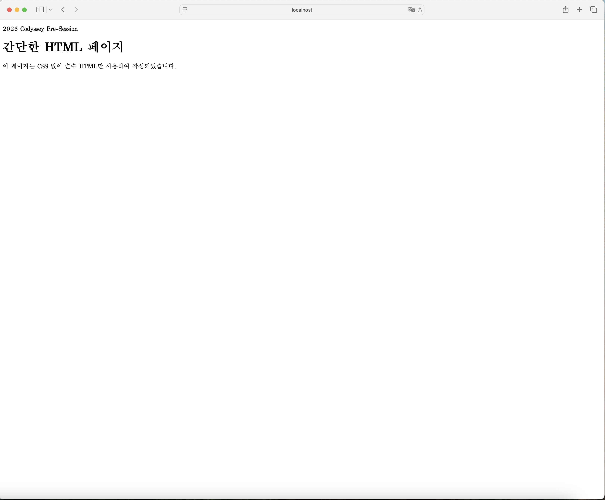
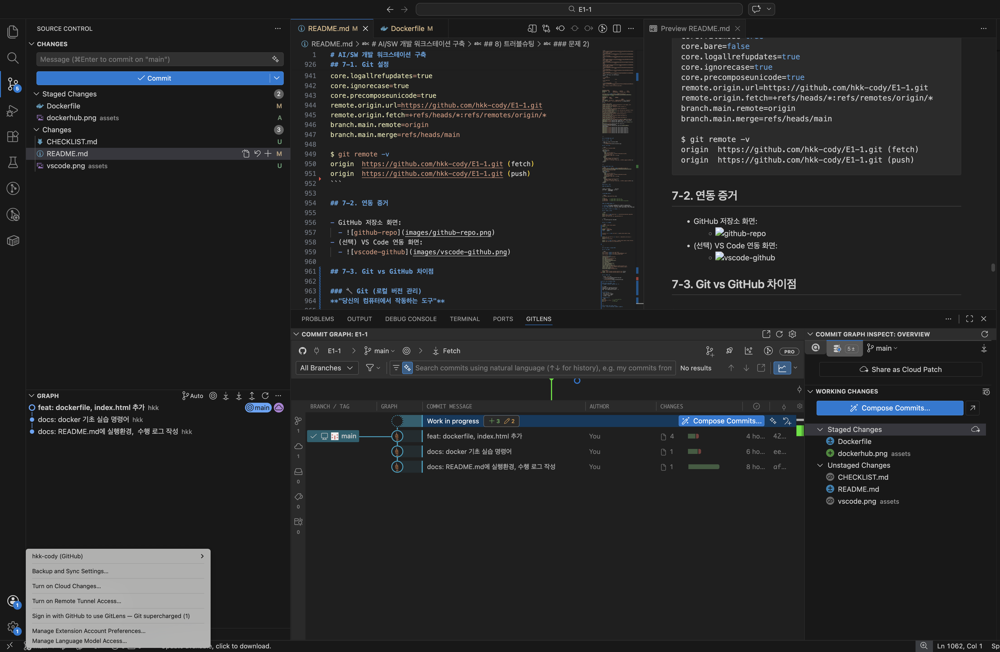
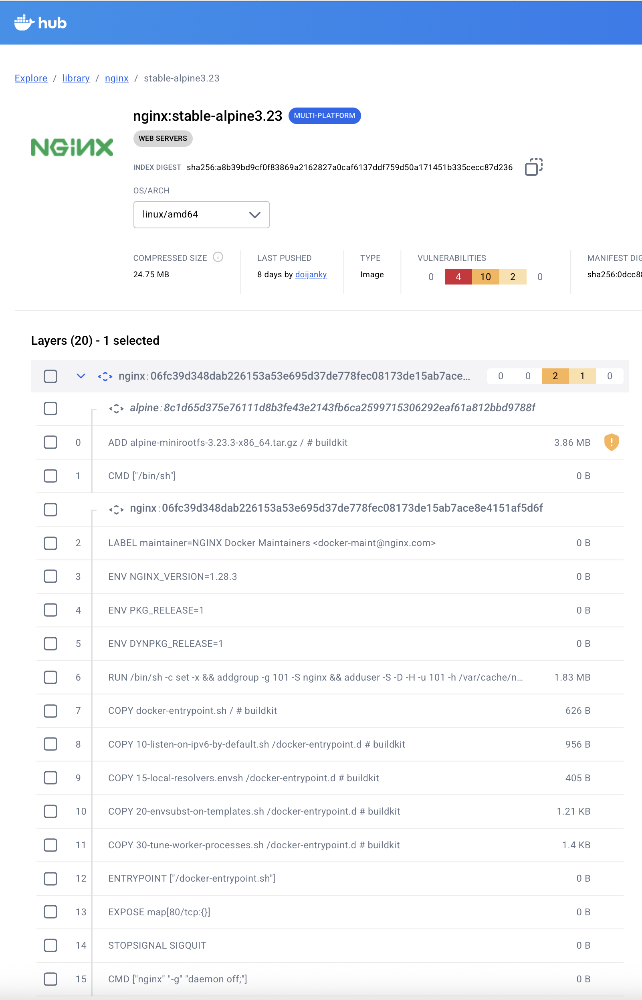

# 0) 프로젝트 개요

- 미션 목표 요약:
  - 본 프로젝트의 목표는 터미널, Docker, Git/GitHub를 직접 설정하고 운영하면서, 재현 가능한 개발 워크스테이션을 구축하는 것입니다.
  - 단순 설치가 아닌 명령 실행 결과(로그), 접속 검증(포트 매핑), 데이터 유지 검증(볼륨)을 통해 실제 동작을 증명하는 데 중점을 둡니다.
  - 최종적으로 README만으로도 동일 절차를 따라 같은 결과를 확인할 수 있는 문서화 품질을 확보하는 것을 목표로 합니다.
- 핵심 도구:
  - 터미널(CLI)
  - Docker(컨테이너)
  - Git/GitHub(버전관리/협업)
- 학습 범위:
  - 경로/파일/권한 기반의 리눅스 CLI 기초 조작
  - Docker 이미지 빌드, 컨테이너 실행/점검, 포트 매핑, 마운트/볼륨 실습
  - Git 설정, 로컬 커밋, 원격 저장소 연동 및 협업 흐름 이해
  - 트러블슈팅 기록(문제-원인 가설-검증-해결) 및 보안/민감정보 마스킹 실천

---

# 1) 실행 환경

- OS: macOS (Darwin 24.6.0, x86_64)
- Shell: /bin/zsh
- Terminal: zsh (VS Code 통합 터미널)
- Docker: 28.5.2 (build ecc6942)
- Git: 2.53.0
- OrbStack / Docker Desktop: OrbStack (Docker Context: orbstack)

## 1-1. 환경 확인 로그

```bash
uname -a
echo $SHELL
docker --version
docker info
git --version
```

```text
$ uname -a
Darwin c5r1s7.codyssey.kr 24.6.0 Darwin Kernel Version 24.6.0: Mon Jan 19 22:00:10 PST 2026; root:xnu-11417.140.69.708.3~1/RELEASE_X86_64 x86_64

$ echo $SHELL
/bin/zsh

$ docker --version
Docker version 28.5.2, build ecc6942

$ docker info
Client:
 Version:    28.5.2
 Context:    orbstack
 Debug Mode: false
 Plugins:
  buildx: Docker Buildx (Docker Inc.)
    Version:  v0.29.1
  compose: Docker Compose (Docker Inc.)
    Version:  v2.40.3

Server:
 Containers: 1
  Running: 0
  Paused: 0
  Stopped: 1
 Images: 1
 Server Version: 28.5.2
 Storage Driver: overlay2
 Cgroup Version: 2
 Operating System: OrbStack
 OSType: linux
 Architecture: x86_64
 CPUs: 6
 Total Memory: 15.67GiB
 Name: orbstack
 Docker Root Dir: /var/lib/docker
 WARNING: DOCKER_INSECURE_NO_IPTABLES_RAW is set

$ git --version
git version 2.53.0
```

---

# 2) 수행 체크리스트

## 2-1. 터미널 기본 조작

- [x] pwd / ls / ls -la
- [x] mkdir / cd
- [x] touch / cat
- [x] cp / mv / rm

## 2-2. 권한 실습

- [x] 파일 권한 변경 (예: 644)
- [x] 디렉토리 권한 변경 (예: 755)
- [x] 변경 전/후 비교 기록

## 2-3. Docker 기본 점검

- [x] docker --version
- [x] docker info
- [x] docker images
- [x] docker ps / docker ps -a

## 2-4. 컨테이너 기초

- [x] hello-world 실행
- [x] ubuntu 컨테이너 진입/명령 실행
- [x] attach vs exec 차이 정리

## 2-5. Dockerfile 기반 커스텀 이미지

- [x] Dockerfile 작성
- [x] docker build 성공
- [x] docker run 성공

## 2-6. 포트 매핑

- [x] `-p <host>:<container>` 실행
- [x] 브라우저 접속 확인
- [x] curl 응답 확인

## 2-7. 마운트/볼륨

- [x] 바인드 마운트 변경 반영 확인
- [x] 볼륨 영속성(삭제 전/후) 확인

## 2-8. Git/GitHub 연동

- [x] git config 설정
- [x] git init / add / commit
- [x] remote 연결 / push
- [x] GitHub 저장소 확인

---

# 3) 수행 로그

## 3-1. 터미널 조작 로그

```bash
$ pwd
/Users/hkkim01035750/E1-1
# 현재 위치

$ ls
CHECKLIST.md    dockerfile      README.md
# 파일과 디렉토리 목록

$ ls -al
total 112
drwxr-xr-x   6 hkkim01035750  hkkim01035750    192 Apr  2 12:11 .
drwxr-x---+ 26 hkkim01035750  hkkim01035750    832 Apr  2 11:48 ..
drwxr-xr-x  12 hkkim01035750  hkkim01035750    384 Mar 31 14:17 .git
-rw-r--r--   1 hkkim01035750  hkkim01035750  42247 Apr  2 12:11 CHECKLIST.md
-rw-r--r--   1 hkkim01035750  hkkim01035750     95 Mar 31 13:23 dockerfile
-rw-r--r--   1 hkkim01035750  hkkim01035750   7638 Apr  2 12:13 README.md


$ mkdir -p ~/workstation/project
# 상위 디렉토리가 없으면 자동으로 만들면서 디렉토리를 생성

$ cd ~/workstation/project

$ pwd
/Users/hkkim01035750/workstation/project

$ cd ..

$ pwd
/Users/hkkim01035750/workstation
# 부모 디텍토리

$ cd ~
$ pwd
/Users/hkkim01035750
# 홈 디렉토리

$ cd -
$ pwd
~/workstation/project
# 이전 디렉토리

$ touch test.txt
# 빈 파일 생성 & 파일 수정 시간 업데이트

$ ls -al test.txt
-rw-r--r--  1 hkkim01035750  hkkim01035750  0 Apr  2 13:00 test.txt

$ touch file1.txt file2.txt file3.txt
# 여러 파일 한 번에 생성

$ touch -t 202401151030 test.txt
# 특정 시간으로 설정 (2024년 1월 15일 10:30)

$ ls -al test.txt
-rw-r--r--  1 hkkim01035750  hkkim01035750  0 Jan 15  2024 test.txt

$ cat test.txt
# 단일 파일 내용 출력

$ cat file1.txt file2.txt file3.txt
# 여러 파일 내용 순서대로 출력

$ cat > newfile.txt
Hello, World!
This is a test.
# 직접 입력하며 파일 생성 (Ctrl+D로 종료)

$ cat >> newfile.txt
aaaaa
bbbbb
ccccc
# 기존 파일에 추가로 입력

$ cat newfile.txt
Hello, World!
This is a test.
aaaaa
bbbbb
ccccc

$ cat > config.txt << EOF
server=localhost
port=8080
debug=true
EOF
# 히어독(<<EOF) 방식 입력 종료 신호 (EOF)

$ cp source.txt destination.txt
# 파일 복사

$ mv file.txt /path/to/directory/
# 다른 디렉토리로 파일 이동

$ mv file.txt file1.txt
# 파일 이름 변경

$ rm test.txt
# 파일 삭제

$ rm -i test.txt
remove test.txt? y
# 삭제 전 확인

$ rm -r directory_with_files
# 디렉토리와 내용 모두 삭제

$ rm -f test.txt
# 강제 삭제 (확인 없이) (-f: force)

```

## 3-2. 권한 변경 로그

```bash
$ touch test_file.txt

$ ls -l test_file.txt
-rw-r--r--  1 hkkim01035750  hkkim01035750  0 Apr  2 12:37 test_file.txt

$ chmod 777 test_file.txt
# 권한 변경

$ ls -l test_file.txt
-rwxrwxrwx  1 hkkim01035750  hkkim01035750  0 Apr  2 12:37 test_file.txt

$ mkdir test_dir

$ ls -ld test_dir
drwxr-xr-x  2 hkkim01035750  hkkim01035750  64 Apr  2 12:48 test_dir
# 디렉토리 자체 정보 확인

$ chmod 777 test_dir

$ ls -ld test_dir
drwxrwxrwx  2 hkkim01035750  hkkim01035750  64 Apr  2 12:50 test_dir

```
### 알아두면 좋을 정보
#### ls -al 출력 정보 상세 설명

`ls -al`은 현재 디렉토리의 모든 파일/폴더를 상세 정보와 함께 표시합니다.

#### 출력 예시
```
drwxr-xr-x  5 user  group   4096 Jan 15 10:30 .
drwxr-xr-x 15 root  root    4096 Jan 10 09:20 ..
-rw-r--r--  1 user  group    256 Jan 15 10:25 file.txt
drwxr-xr-x  3 user  group   4096 Jan 15 10:30 folder
```

#### 각 열의 의미

| 항목 | 예시 | 설명 |
|------|------|------|
| **1열** | `drwxr-xr-x` | 파일 타입과 권한 |
| **2열** | `5` | 링크 수 (하드링크 개수) |
| **3열** | `user` | 파일 소유자 |
| **4열** | `group` | 파일 소유 그룹 |
| **5열** | `4096` | 파일 크기 (바이트) |
| **6~8열** | `Jan 15 10:30` | 수정 날짜와 시간 |
| **9열** | `file.txt` | 파일/폴더명 |

#### 1열 상세 분석: `drwxr-xr-x`

```
d rwx r-x r-x
│ │   │   │
│ │   │   └─ 기타 사용자 권한
│ │   └───── 그룹 권한
│ └───────── 소유자 권한
└─────────── 파일 타입
```

#### 파일 타입
- `d` : 디렉토리 (directory)
- `-` : 일반 파일
- `l` : 심볼릭 링크
- `b` : 블록 디바이스
- `c` : 문자 디바이스

#### 권한 (rwx)
- `r` (read) : 읽기 권한 (4)
- `w` (write) : 쓰기 권한 (2)
- `x` (execute) : 실행 권한 (1)
- `-` : 권한 없음

#### 8진수 권한 표기법 이해

```
r w x  = 4 + 2 + 1 = 7  (모든 권한)
r - x  = 4 + 0 + 1 = 5  (읽기, 실행)
r w -  = 4 + 2 + 0 = 6  (읽기, 쓰기)
r - -  = 4 + 0 + 0 = 4  (읽기만)
```

#### 절대 경로 vs 상대 경로

**절대 경로** (Absolute Path)

- 루트(`/`)에서부터 시작하는 전체 경로
- 어느 위치에서든 동일

```bash
/Users/hankkim/workstation/project
/home/username/documents
/opt/app
```

**상대 경로** (Relative Path)

- 현재 위치(`.`)를 기준으로 한 경로
- 위치에 따라 달라짐

```bash
./project          # 현재 디렉토리의 project
../documents       # 상위 디렉토리의 documents
../../file.txt     # 2단계 상위 디렉토리의 file.txt
```

#### 자주 사용하는 특수 경로

```bash
~              # 홈 디렉토리 (/Users/username 또는 /home/username)
.              # 현재 디렉토리
..             # 상위 디렉토리
/              # 루트 디렉토리
$HOME          # 홈 디렉토리 (변수)
$PWD           # 현재 디렉토리 (변수)
```


## 3-3. Docker 운영/검증 실행 실습 로그

```bash
$ docker --version
Docker version 28.5.2, build ecc6942

$ docker info
Client:
 Version:    28.5.2
 Context:    orbstack
 Debug Mode: false
 Plugins:
  buildx: Docker Buildx (Docker Inc.)
    Version:  v0.29.1
    Path:     /Users/hkkim01035750/.docker/cli-plugins/docker-buildx
  compose: Docker Compose (Docker Inc.)
    Version:  v2.40.3
    Path:     /Users/hkkim01035750/.docker/cli-plugins/docker-compose

Server:
 Containers: 1
  Running: 0
  Paused: 0
  Stopped: 1
 Images: 1
 Server Version: 28.5.2
 Storage Driver: overlay2
  Backing Filesystem: btrfs
  Supports d_type: true
  Using metacopy: false
  Native Overlay Diff: true
  userxattr: false
 Logging Driver: json-file
 Cgroup Driver: cgroupfs
 Cgroup Version: 2
 Plugins:
  Volume: local
  Network: bridge host ipvlan macvlan null overlay
  Log: awslogs fluentd gcplogs gelf journald json-file local splunk syslog
 CDI spec directories:
  /etc/cdi
  /var/run/cdi
 Swarm: inactive
 Runtimes: runc io.containerd.runc.v2
 Default Runtime: runc
 Init Binary: docker-init
 containerd version: 1c4457e00facac03ce1d75f7b6777a7a851e5c41
 runc version: d842d7719497cc3b774fd71620278ac9e17710e0
 init version: de40ad0
 Security Options:
  seccomp
   Profile: builtin
  cgroupns
 Kernel Version: 6.17.8-orbstack-00308-g8f9c941121b1
 Operating System: OrbStack
 OSType: linux
 Architecture: x86_64
 CPUs: 6
 Total Memory: 15.67GiB
 Name: orbstack
 ID: b952bb99-0bdb-4eb7-9eee-16a7802bf6d4
 Docker Root Dir: /var/lib/docker
 Debug Mode: false
 Experimental: false
 Insecure Registries:
  ::1/128
  127.0.0.0/8
 Live Restore Enabled: false
 Product License: Community Engine
 Default Address Pools:
   Base: 192.168.97.0/24, Size: 24
   Base: 192.168.107.0/24, Size: 24
   Base: 192.168.117.0/24, Size: 24
   Base: 192.168.147.0/24, Size: 24
   Base: 192.168.148.0/24, Size: 24
   Base: 192.168.155.0/24, Size: 24
   Base: 192.168.156.0/24, Size: 24
   Base: 192.168.158.0/24, Size: 24
   Base: 192.168.163.0/24, Size: 24
   Base: 192.168.164.0/24, Size: 24
   Base: 192.168.165.0/24, Size: 24
   Base: 192.168.166.0/24, Size: 24
   Base: 192.168.167.0/24, Size: 24
   Base: 192.168.171.0/24, Size: 24
   Base: 192.168.172.0/24, Size: 24
   Base: 192.168.181.0/24, Size: 24
   Base: 192.168.183.0/24, Size: 24
   Base: 192.168.186.0/24, Size: 24
   Base: 192.168.207.0/24, Size: 24
   Base: 192.168.214.0/24, Size: 24
   Base: 192.168.215.0/24, Size: 24
   Base: 192.168.216.0/24, Size: 24
   Base: 192.168.223.0/24, Size: 24
   Base: 192.168.227.0/24, Size: 24
   Base: 192.168.228.0/24, Size: 24
   Base: 192.168.229.0/24, Size: 24
   Base: 192.168.237.0/24, Size: 24
   Base: 192.168.239.0/24, Size: 24
   Base: 192.168.242.0/24, Size: 24
   Base: 192.168.247.0/24, Size: 24
   Base: fd07:b51a:cc66:d000::/56, Size: 64

WARNING: DOCKER_INSECURE_NO_IPTABLES_RAW is set
```
```bash
$ docker run hello-world
Unable to find image 'hello-world:latest' locally
latest: Pulling from library/hello-world
4f55086f7dd0: Pull complete 
Digest: sha256:452a468a4bf985040037cb6d5392410206e47db9bf5b7278d281f94d1c2d0931
Status: Downloaded newer image for hello-world:latest

Hello from Docker!
This message shows that your installation appears to be working correctly.

To generate this message, Docker took the following steps:
 1. The Docker client contacted the Docker daemon.
 2. The Docker daemon pulled the "hello-world" image from the Docker Hub.
    (amd64)
 3. The Docker daemon created a new container from that image which runs the
    executable that produces the output you are currently reading.
 4. The Docker daemon streamed that output to the Docker client, which sent it
    to your terminal.

To try something more ambitious, you can run an Ubuntu container with:
 $ docker run -it ubuntu bash

Share images, automate workflows, and more with a free Docker ID:
 https://hub.docker.com/

For more examples and ideas, visit:
 https://docs.docker.com/get-started/

$ docker images
REPOSITORY    TAG       IMAGE ID       CREATED       SIZE
hello-world   latest    e2ac70e7319a   9 days ago    10.1kB
ubuntu        latest    f794f40ddfff   5 weeks ago   78.1MB

$ docker run -it --name my-container ubuntu bash
# Ubuntu 이미지를 기반으로 my-container라는 이름의 새 컨테이너를 만들고, 대화형 터미널로 bash 셸에 접속

$ docker ps
CONTAINER ID   IMAGE     COMMAND   CREATED         STATUS         PORTS     NAMES
ef48d8d1145e   ubuntu    "bash"    7 seconds ago   Up 7 seconds             my-container
# 현재 실행 중인 컨테이너만 표시

$ docker ps -a
CONTAINER ID   IMAGE         COMMAND       CREATED              STATUS                      PORTS     NAMES
ef48d8d1145e   ubuntu        "bash"        About a minute ago   Up About a minute                     my-container
abbe0a306b53   hello-world   "/hello"      3 minutes ago        Exited (0) 3 minutes ago              mystifying_mccarthy
6ff4c6992680   ubuntu        "/bin/bash"   42 hours ago         Exited (137) 40 hours ago             gracious_leakey
# 모든 컨테이너 표시 (실행 중 + 중지된 것)

$ docker logs my-container
root@ef48d8d1145e:/# ls
bin  boot  dev  etc  home  lib  lib64  media  mnt  opt  proc  root  run  sbin  srv  sys  tmp  usr  var
root@ef48d8d1145e:/# ls -al
total 16
drwxr-xr-x   1 root root   6 Apr  2 04:40 .
drwxr-xr-x   1 root root   6 Apr  2 04:40 ..
-rwxr-xr-x   1 root root   0 Apr  2 04:40 .dockerenv
lrwxrwxrwx   1 root root   7 Apr 22  2024 bin -> usr/bin
drwxr-xr-x   1 root root   0 Apr 22  2024 boot
drwxr-xr-x   5 root root 340 Apr  2 04:40 dev
drwxr-xr-x   1 root root  56 Apr  2 04:40 etc
drwxr-xr-x   1 root root  12 Feb 17 02:09 home
lrwxrwxrwx   1 root root   7 Apr 22  2024 lib -> usr/lib
lrwxrwxrwx   1 root root   9 Apr 22  2024 lib64 -> usr/lib64
drwxr-xr-x   1 root root   0 Feb 17 02:02 media
drwxr-xr-x   1 root root   0 Feb 17 02:02 mnt
drwxr-xr-x   1 root root   0 Feb 17 02:02 opt
dr-xr-xr-x 226 root root   0 Apr  2 04:40 proc
drwx------   1 root root  30 Feb 17 02:09 root
drwxr-xr-x   1 root root  22 Feb 17 02:09 run
lrwxrwxrwx   1 root root   8 Apr 22  2024 sbin -> usr/sbin
drwxr-xr-x   1 root root   0 Feb 17 02:02 srv
dr-xr-xr-x  11 root root   0 Apr  2 04:40 sys
drwxrwxrwt   1 root root   0 Feb 17 02:09 tmp
drwxr-xr-x   1 root root  10 Feb 17 02:02 usr
drwxr-xr-x   1 root root  90 Feb 17 02:09 var
root@ef48d8d1145e:/# echo hello
hello

$ docker stats --no-stream
CONTAINER ID   NAME           CPU %     MEM USAGE / LIMIT     MEM %     NET I/O         BLOCK I/O     PIDS
ef48d8d1145e   my-container   0.00%     4.449MiB / 15.67GiB   0.03%     1.13kB / 126B   9.49MB / 0B   1
# 실행 중인 컨테이너의 자원 사용량을 확인하는 명령어
# --no-steam : 한번만 현재 상태 찍고 종료

$ docker ps -a | grep hello-world
abbe0a306b53   hello-world   "/hello"      38 minutes ago   Exited (0) 38 minutes ago             mystifying_mccarthy

$ docker ps
CONTAINER ID   IMAGE     COMMAND   CREATED             STATUS          PORTS     NAMES
ef48d8d1145e   ubuntu    "bash"    About an hour ago   Up 13 minutes             my-container

$ docker stop my-container 
my-container

$ docker rm gracious_leakey
# 종료된 컨테이너 1개 삭제

$ docker rm -f gracious_leakey
# 실행 중인 컨테이너 강제 삭제

$ docker container prune
WARNING! This will remove all stopped containers.
Are you sure you want to continue? [y/N] y
Deleted Containers:
ef48d8d1145e64b3f68e56b273e0fb573994610c166bbea4a35251b7d1ee9ecc
abbe0a306b5324f30d657d0072d76028cc6cace1c15df8b5961eb51bf448dc95
6ff4c6992680f3aff3c1cb75e63c57d5081dfaf928406f57b57e22d4b4174021
# 종료된 컨테이너 전체 삭제

$ docker ps -a          
CONTAINER ID   IMAGE     COMMAND   CREATED   STATUS    PORTS     NAMES

$ docker image ls
REPOSITORY    TAG       IMAGE ID       CREATED       SIZE
hello-world   latest    e2ac70e7319a   9 days ago    10.1kB
ubuntu        latest    f794f40ddfff   5 weeks ago   78.1MB

$ docker rmi hello-world
Untagged: hello-world:latest
Untagged: hello-world@sha256:452a468a4bf985040037cb6d5392410206e47db9bf5b7278d281f94d1c2d0931
Deleted: sha256:e2ac70e7319a02c5a477f5825259bd118b94e8b02c279c67afa63adab6d8685b
Deleted: sha256:897b3f2a7c1bc2f3d02432f7892fe31c6272c521ad4d70257df624504a3238b4
# 참조 중이 아닌 이미지 삭제

$ docker rmi  -f hello-world
# 참조 중인 이미지 강제 삭제

$ docker image ls       
REPOSITORY   TAG       IMAGE ID       CREATED       SIZE
ubuntu       latest    f794f40ddfff   5 weeks ago   78.1MB

$ docker image prune
# dangling 이미지, 사용중이지 않은 이미지 삭제

$ docker system prune
WARNING! This will remove:
  - all stopped containers
  - all networks not used by at least one container
  - all dangling images
  - unused build cache
# Dangling 이미지 + 중지된 컨테이너 + 네트워크 모두 삭제

$ docker system prune -a
WARNING! This will remove:
  - all stopped containers
  - all networks not used by at least one container
  - all images without at least one container associated to them
  - all build cache

Are you sure you want to continue? [y/N] 
# 미사용 리소스 정리 모두 삭제
```

### attach
- 기존 프로세스에 직접 연결
- 기존 컨테이너에 영향
- 컨테이너 종료안하고 연결 끊는 방법
    - `ctrl + p, ctrl + q`
```bash
docker attach my-container
```

### exec
- 컨테이너 내부에 새 프로세스 생성
- 기존 서비스 그대로 유지
- 명령 끝나면 새 프로세스만 종료
- 안전하게 내부 확인 가능
```
hkkim01035750@c5r1s7 E1-1 % docker exec -it my-container /bin/bash
root@ef48d8d1145e:/# ls
bin  boot  dev  etc  home  lib  lib64  media  mnt  opt  proc  root  run  sbin  srv  sys  tmp  usr  var
```

### 알면 좋은 내용

#### Docker 주요 개념

**이미지 (Image)**

- 컨테이너를 만들기 위한 "설계도" 또는 "템플릿"
- 재사용 가능하고, 변경 불가능한(immutable) 스냅샷
- 레이어 구조로 구성됨

**컨테이너 (Container)**

- 이미지에서 만들어진 "실행 인스턴스"
- 격리된 프로세스 환경에서 독립적으로 실행
- 여러 개를 동시에 실행 가능

#### docker run 옵션 이해

```bash
docker run [OPTIONS] IMAGE [COMMAND] [ARG...]
```

**자주 사용하는 옵션:**

| 옵션     | 설명                            |
| -------- | ------------------------------- |
| `-d`     | Detach (백그라운드 실행)        |
| `-it`    | Interactive + TTY (터미널 접속) |
| `--name` | 컨테이너에 이름 부여            |
| `-p`     | 포트 매핑 (호스트:컨테이너)     |
| `-v`     | 볼륨 마운트                     |
| `-e`     | 환경 변수 설정                  |
| `--rm`   | 종료 시 자동 삭제               |

#### 실행 예시

```bash
# 포그라운드 (foreground) - 터미널에서 직접 보임
docker run ubuntu echo "Hello"

# 백그라운드 (background) - 컨테이너 ID 반환 - 호스트 pc에서 백그라운드, 컨테이너에서는 포어그라운드
docker run -d ubuntu sleep 1000

# 대화형 - 컨테이너 내부 쉘 접속
docker run -it ubuntu /bin/bash

# 이름과 함께 실행
docker run --name my-container ubuntu sleep 100

# 특정 포트로 웹 서버 실행
docker run -d -p 8080:80 nginx

# 환경 변수 설정
docker run -e APP_ENV=production ubuntu
```

#### 컨테이너 상태 확인

```bash
# 실행 중인 컨테이너만 보기
docker ps

# 모든 컨테이너 보기 (종료된 것 포함)
docker ps -a

# 마지막 5개 컨테이너
docker ps -n 5

# 컨테이너 로그 확인
docker logs <container_id>

# 실시간 로그 보기
docker logs -f <container_id>

# 리소스 사용량 보기
docker stats
```

#### Dangling 이미지란
- **태그가 없는 이미지** (`<none>:<none>`)
- 태그가 지정되지 않아 더 이상 특정 이미지나 활성 컨테이너와 연결되지 않은 이미지
- REPOSITORY와 TAG가 모두 <none>으로 표시되는 이미지
```bash
$ docker build -t myapp:latest .
$ docker images                 
REPOSITORY   TAG       IMAGE ID       CREATED        SIZE
myapp        latest    ee932089033b   47 hours ago   62.2MB
$ docker build -t myapp:latest .
# 두번째 이미지 빌드 시 dockerfile을 첫번째와 다르게 해야한다.
# 같은 dockerfile로 빌드 시 캐시를 사용해서 같은 이미지 생성 (id가 바뀌지 않는다.)

$ docker images                 
REPOSITORY   TAG       IMAGE ID       CREATED         SIZE
myapp        latest    4df373e8ccda   2 seconds ago   62.2MB
<none>       <none>    ee932089033b   47 hours ago    62.2MB

$ docker build --no-cache -t myapp:latest .
# 캐시 무시하고 이미지 빌드하는 방법
```

#### 사용 중이지 않은 이미지 (Unused)란
- **태그는 있지만 실행 중인 컨테이너가 없는 이미지**
- 예: `myapp:1.0` 이미지가 존재하지만 이를 사용하는 컨테이너가 없음

---

# 4) Dockerfile 기반 웹 서버 컨테이너

## 4-1. 폴더 구조

```text
.
├─ app/
│  └─ index.html
├─ Dockerfile
└─ README.md
```

## 4-2. Dockerfile

```dockerfile
FROM nginx:alpine
LABEL org.opencontainers.image.title="my-custom-nginx"
LABEL org.opencontainers.image.author="hkk"

ENV APP_ENV=dev

# 웹 콘텐츠 복사
COPY app/ /usr/share/nginx/html/

# 포트 노출 명시적으로 작성
EXPOSE 80
```

## 4-3. 빌드/실행 로그

```bash
$ docker build -t my-web:1.0 .
[+] Building 7.4s (7/7) FINISHED                                                                    docker:orbstack
 => [internal] load build definition from Dockerfile                                                           0.2s
 => => transferring dockerfile: 296B                                                                           0.0s
 => [internal] load metadata for docker.io/library/nginx:alpine                                                2.6s
 => [internal] load .dockerignore                                                                              0.2s
 => => transferring context: 2B                                                                                0.0s
 => [internal] load build context                                                                              0.2s
 => => transferring context: 464B                                                                              0.0s
 => [1/2] FROM docker.io/library/nginx:alpine@sha256:e7257f1ef28ba17cf7c248cb8ccf6f0c6e0228ab9c315c152f9c203c  3.6s
 => => resolve docker.io/library/nginx:alpine@sha256:e7257f1ef28ba17cf7c248cb8ccf6f0c6e0228ab9c315c152f9c203c  0.2s
 => => sha256:7e89aa6cabfc80f566b1b77b981f4bb98413bd2d513ca9a30f63fe58b4af6903 2.50kB / 2.50kB                 0.0s
 => => sha256:e7257f1ef28ba17cf7c248cb8ccf6f0c6e0228ab9c315c152f9c203cd34cf6d1 10.33kB / 10.33kB               0.0s
 => => sha256:d5030d429039a823bef4164df2fad7a0defb8d00c98c1136aec06701871197c2 12.32kB / 12.32kB               0.0s
 => => sha256:589002ba0eaed121a1dbf42f6648f29e5be55d5c8a6ee0f8eaa0285cc21ac153 3.86MB / 3.86MB                 0.5s
 => => sha256:8892f80f46a05d59a4cde3bcbb1dd26ed2441d4214870a4a7b318eaa476a0a54 1.87MB / 1.87MB                 0.7s
 => => sha256:91d1c9c22f2c631288354fadb2decc448ce151d7a197c167b206588e09dcd50a 626B / 626B                     0.9s
 => => extracting sha256:589002ba0eaed121a1dbf42f6648f29e5be55d5c8a6ee0f8eaa0285cc21ac153                      0.1s
 => => sha256:cf1159c696ee2a72b85634360dbada071db61bceaad253db7fda65c45a58414c 953B / 953B                     1.0s
 => => extracting sha256:8892f80f46a05d59a4cde3bcbb1dd26ed2441d4214870a4a7b318eaa476a0a54                      0.1s
 => => sha256:3f4ad4352d4f91018e2b4910b9db24c08e70192c3b75d0d6fff0120c838aa0bb 402B / 402B                     1.2s
 => => sha256:c2bd5ab177271dd59f19a46c214b1327f5c428cd075437ec0155ae71d0cdadc1 1.21kB / 1.21kB                 1.3s
 => => extracting sha256:91d1c9c22f2c631288354fadb2decc448ce151d7a197c167b206588e09dcd50a                      0.0s
 => => extracting sha256:cf1159c696ee2a72b85634360dbada071db61bceaad253db7fda65c45a58414c                      0.0s
 => => sha256:4d9d41f3822d171ccc5f2cdfd75ad846ac4c7ed1cd36fb998fe2c0ce4501647b 1.40kB / 1.40kB                 1.5s
 => => extracting sha256:3f4ad4352d4f91018e2b4910b9db24c08e70192c3b75d0d6fff0120c838aa0bb                      0.0s
 => => sha256:3370263bc02adcf5c4f51831d2bf1d54dbf9a6a80b0bf32c5c9b9400630eaa08 20.25MB / 20.25MB               2.0s
 => => extracting sha256:c2bd5ab177271dd59f19a46c214b1327f5c428cd075437ec0155ae71d0cdadc1                      0.0s
 => => extracting sha256:4d9d41f3822d171ccc5f2cdfd75ad846ac4c7ed1cd36fb998fe2c0ce4501647b                      0.0s
 => => extracting sha256:3370263bc02adcf5c4f51831d2bf1d54dbf9a6a80b0bf32c5c9b9400630eaa08                      0.4s
 => [2/2] COPY app/ /usr/share/nginx/html/                                                                     0.3s
 => exporting to image                                                                                         0.2s
 => => exporting layers                                                                                        0.1s
 => => writing image sha256:ee932089033b82a027b5b0d3a07d1df7563f4cfbf08d1dfe2b7819002c387484                   0.0s
 => => naming to docker.io/library/my-web:1.0                                                                  0.0s


$ docker images
REPOSITORY   TAG       IMAGE ID       CREATED         SIZE
my-web       1.0       ee932089033b   7 minutes ago   62.2MB

$ docker run -d --name my-web -p 8080:80 my-web:1.0
5522ca90b323a8811268f786c77c46919d80c3cee1a18c0a0ebce158624423cc
# 컨테이너 id(고유 식별자)

$ docker ps
CONTAINER ID   IMAGE        COMMAND                  CREATED         STATUS         PORTS                                     NAMES
5522ca90b323   my-web:1.0   "/docker-entrypoint.…"   2 minutes ago   Up 2 minutes   0.0.0.0:8080->80/tcp, [::]:8080->80/tcp   my-web

$ docker logs my-web
/docker-entrypoint.sh: /docker-entrypoint.d/ is not empty, will attempt to perform configuration
/docker-entrypoint.sh: Looking for shell scripts in /docker-entrypoint.d/
/docker-entrypoint.sh: Launching /docker-entrypoint.d/10-listen-on-ipv6-by-default.sh
10-listen-on-ipv6-by-default.sh: info: Getting the checksum of /etc/nginx/conf.d/default.conf
10-listen-on-ipv6-by-default.sh: info: Enabled listen on IPv6 in /etc/nginx/conf.d/default.conf
/docker-entrypoint.sh: Sourcing /docker-entrypoint.d/15-local-resolvers.envsh
/docker-entrypoint.sh: Launching /docker-entrypoint.d/20-envsubst-on-templates.sh
/docker-entrypoint.sh: Launching /docker-entrypoint.d/30-tune-worker-processes.sh
/docker-entrypoint.sh: Configuration complete; ready for start up
2026/04/02 07:39:50 [notice] 1#1: using the "epoll" event method
2026/04/02 07:39:50 [notice] 1#1: nginx/1.29.7
2026/04/02 07:39:50 [notice] 1#1: built by gcc 15.2.0 (Alpine 15.2.0) 
2026/04/02 07:39:50 [notice] 1#1: OS: Linux 6.17.8-orbstack-00308-g8f9c941121b1
2026/04/02 07:39:50 [notice] 1#1: getrlimit(RLIMIT_NOFILE): 20480:1048576
2026/04/02 07:39:50 [notice] 1#1: start worker processes
2026/04/02 07:39:50 [notice] 1#1: start worker process 30
2026/04/02 07:39:50 [notice] 1#1: start worker process 31
2026/04/02 07:39:50 [notice] 1#1: start worker process 32
2026/04/02 07:39:50 [notice] 1#1: start worker process 33
2026/04/02 07:39:50 [notice] 1#1: start worker process 34
2026/04/02 07:39:50 [notice] 1#1: start worker process 35
```

---

# 5) 포트 매핑 접속 증거

## 5-1. 브라우저 접속

- 접속 주소: http://localhost:8080
- 증거 이미지:
  - 

## 5-2. curl 응답

```bash
$ curl http://localhost:8080

<!DOCTYPE html>
<html lang="ko">
  <head>
    <meta charset="UTF-8" />
    <meta name="viewport" content="width=device-width, initial-scale=1.0" />
    <title>간단한 HTML 페이지</title>
  </head>
  <body>
    <p>2026 Codyssey Pre-Session</p>
    <h1>간단한 HTML 페이지</h1>
    <p>이 페이지는 CSS 없이 순수 HTML만 사용하여 작성되었습니다.</p>
  </body>
</html>
```

---

## 5-3. 다른 포트로 접속
```bash
$ docker run -d -p 8081:80 --name my-web-8081 my-web:1.0
6fb8169ee7a8e0b364c78c5d96e69ebf8d2139005bb0626cbbd94be43dc41e42
$  curl http://localhost:8081
<!DOCTYPE html>
<html lang="ko">
  <head>
    <meta charset="UTF-8" />
    <meta name="viewport" content="width=device-width, initial-scale=1.0" />
    <title>간단한 HTML 페이지</title>
  </head>
  <body>
    <p>2026 Codyssey Pre-Session</p>
    <h1>간단한 HTML 페이지</h1>
    <p>이 페이지는 CSS 없이 순수 HTML만 사용하여 작성되었습니다.</p>
  </body>
</html>
```

## 5-4. port 매핑 확인
```bash
$ docker port my-web
80/tcp -> 0.0.0.0:8080
80/tcp -> [::]:8080
```
```bash
$ docker inspect my-web | grep IPAddress
            "SecondaryIPAddresses": null,
            "IPAddress": "192.168.215.2",
                    "IPAddress": "192.168.215.2",
# 컨테이너 IP 주소 확인

$ docker exec my-web netstat -tlnp
Proto Recv-Q Send-Q Local Address           Foreign Address         State       PID/Program name    
tcp        0      0 0.0.0.0:80              0.0.0.0:*               LISTEN      1/nginx: master pro
tcp        0      0 :::80                   :::*                    LISTEN      1/nginx: master pro
# 컨테이너 내부에서 포트 확인
```

### 알면 좋은 내용

#### 포트 매핑 이해

```
호스트 (내 컴퓨터)          컨테이너
port 8080    ──────────→  port 80
            (포트 매핑)
```

**포트 매핑 문법:**

```bash
-p <호스트_포트>:<컨테이너_포트>

# 예시
-p 8080:80      # 호스트 8080 → 컨테이너 80
-p 3000:3000    # 호스트 3000 → 컨테이너 3000
-p 5432:5432    # 호스트 5432 → 컨테이너 5432 (PostgreSQL)
```

#### 포트 매핑이 필요한 이유

1. **격리**: 컨테이너는 호스트와 분리된 네트워크 네임스페이스
2. **접근성**: 호스트에서 컨테이너 서비스에 접근하려면 매핑 필요
3. **여러 컨테이너**: 같은 컨테이너 포트를 다른 호스트 포트로 매핑 가능

#### 이미지 검사

```bash
# 이미지 상세 정보 확인
docker inspect my-web:1.0

# 이미지 히스토리 확인 (레이어 정보)
docker history my-web:1.0

# 이미지 용량 자세히 보기
docker system df
```

# 6) 바인드 마운트 & 볼륨 영속성 검증

## 6-1. 바인드 마운트

```bash
$ mkdir -p ~/workstation/web-data
# 연결할 작업 디렉토리 생성

$ echo "Initial content" > ~/workstation/web-data/data.txt
# 테스트 파일 생성

$ docker run -d -v ~/workstation/web-data:/app/data --name mount-test ubuntu sleep 1000
afaeaeb102b77fc9a2048c9e974e9f4a31987341e0d6ca555830099c18ef060c
# 바인드 마운트로 컨테이너 실행

$ docker exec mount-test cat /app/data/data.txt
Initial content
# 호스트에서 생성한 파일이 잘 보이는 것을 확인

$ echo "Modified from host" >> ~/workstation/web-data/data.txt
# 호스트에서 파일 수정

$ cat ~/workstation/web-data/data.txt
Initial content
Modified from host
# 데이터 확인

$ docker exec mount-test cat /app/data/data.txt
Initial content
Modified from host
# 컨테이너에서 변경 사항 확인

$ docker exec mount-test bash -c "echo 'Created in container' > /app/data/newfile.txt"
# 컨테이너에서 파일 생성

$ ls ~/workstation/web-data/
data.txt        newfile.txt
# 호스트에서 생성된 파일 확인

$ cat ~/workstation/web-data/newfile.txt
Created in container
# 생성된 파일 내용 확인

$ docker stop mount-test
$ docker rm mount-test

$ ls ~/workstation/web-data/
data.txt        newfile.txt

$ cat ~/workstation/web-data/newfile.txt
Created in container
# 컨테이너 종료, 삭제 후에도 호스트는 파일이 그대로 있는 것을 확인
```

## 6-2. 볼륨 영속성

```bash
$ docker volume create mydata
mydata
# 볼륨 생성

$ docker volume ls
DRIVER    VOLUME NAME
local     mydata

$ docker run -d -v mydata:/data --name vol-test1 ubuntu sleep 1000
46c2d6cafe8bcfff9ea669439e03470e053601391b9e40192f452e483462fe4c
# 볼륨 연결

$ docker exec vol-test1 bash -c "echo 'Important data' > /data/important.txt"
# 컨테이너 내에서 데이터 작성

$ docker exec vol-test1 cat /data/important.txt
Important data
# 데이터 확인

$ docker run -d -v mydata:/data --name vol-test2 ubuntu sleep 1000
8fe7a5c685fe90d789659892bc5bef63f1c1475d9d6a1e47b1620adb21ae834a

$ docker exec vol-test2 cat /data/important.txt
Important data
# 다른 컨테이너에서 같은 볼륨 마운트에 정보 확인

$ docker exec vol-test2 bash -c "echo 'More data' >> /data/important.txt"
# 두 번째 컨테이너에서 데이터 변경

$ docker exec vol-test2 cat /data/important.txt
Important data
More data
# 변경된 데이터 확인

$ docker exec vol-test1 cat /data/important.txt
Important data
More data
# 첫 번째 컨테이너에서 데이터 확인

```

### 알면 좋은 내용

#### 바인드 마운트 vs 볼륨

| 구분           | 바인드 마운트      | Docker 볼륨            |
| -------------- | ------------------ | ---------------------- |
| 위치           | 호스트의 임의 위치 | Docker이 관리하는 위치 |
| 성능           | 낮음 (OS 오버헤드) | 높음 (Docker 최적화)   |
| 관리           | 수동               | 자동                   |
| 사용 목적      | 개발 중 파일 공유  | 프로덕션 데이터 영속성 |
| 삭제 시 데이터 | 호스트에만 남음    | 별도 명령으로 삭제     |

#### 바인드 마운트 구문

```bash
# 기본 형식
-v <host_path>:<container_path>

# 읽기 전용 마운트
-v <host_path>:<container_path>:ro

# 예시
docker run -v /home/user/data:/app/data ubuntu
docker run -v $(pwd)/source:/app/source:ro ubuntu
docker run -v ~/documents:/documents ubuntu
```

#### Docker 볼륨 구문

```bash
# 기본 형식
-v <volume_name>:<container_path>

# 예시
docker run -v mydata:/data ubuntu
docker run -v mydb:/var/lib/mysql mysql
docker run -v logs:/app/logs node-app
```

#### 볼륨 관리 명령어

```bash
# 볼륨 생성
docker volume create mydata

# 볼륨 목록
docker volume ls

# 볼륨 정보 확인
docker volume inspect mydata

# 사용하지 않는 볼륨 정리
docker volume prune

# 특정 볼륨 삭제
docker volume rm mydata
```

---

# 7) Git 설정 및 GitHub 연동

## 7-1. Git 설정

```bash
$ git config --global user.name "hkk"
$ git config --global user.email "hkkim0103@naver.com"
$ git config --global init.defaultBranch main

$ git config --list
credential.helper=osxkeychain
user.name=hkk
user.email=hkkim0103@naver.com
init.defaultbranch=main
core.repositoryformatversion=0
core.filemode=true
core.bare=false
core.logallrefupdates=true
core.ignorecase=true
core.precomposeunicode=true
remote.origin.url=https://github.com/hkk-cody/E1-1.git
remote.origin.fetch=+refs/heads/*:refs/remotes/origin/*
branch.main.remote=origin
branch.main.merge=refs/heads/main

$ git remote -v
origin  https://github.com/hkk-cody/E1-1.git (fetch)
origin  https://github.com/hkk-cody/E1-1.git (push)
```

## 7-2. 연동 증거

- VS Code 연동 화면:
  - 

## 7-3. Git vs GitHub 차이점

### 🔧 Git (로컬 버전 관리)
**"당신의 컴퓨터에서 작동하는 도구"**

```
내 컴퓨터
├── 작업 폴더 (Working Directory)
├── 스테이징 영역 (Staging Area)
└── 저장소 (Repository) ← Git이 관리
```

**주요 기능:**
- 파일 변경 이력 추적
- 이전 버전으로 돌아가기
- 브랜치로 독립적 작업
- 로컬에서만 작동

**명령어 예시:**
```bash
git add .              # 변경사항 스테이징
git commit -m "메시지" # 버전 저장
git log               # 이력 확인
```

---

### 🌐 GitHub (원격 협업 플랫폼)
**"Git 저장소를 클라우드에 올려놓는 서비스"**

```
GitHub 클라우드
├── 원격 저장소 (Remote Repository)
├── Pull Request (코드 리뷰)
├── Issues (이슈 관리)
└── 팀 협업 기능
```

**주요 기능:**
- 로컬 저장소를 온라인에 백업
- 팀원과 코드 공유
- Pull Request로 코드 리뷰
- 프로젝트 관리 및 협업

**명령어 예시:**
```bash
git push origin main   # GitHub에 업로드
git pull origin main   # GitHub에서 다운로드
git clone <URL>       # 원격 저장소 복제
```

---

## 📊 비교표

| 항목 | Git | GitHub |
|------|-----|--------|
| **설치** | 필수 설치 | 웹 기반 (설치 불필요) |
| **위치** | 로컬 컴퓨터 | 클라우드 서버 |
| **협업** | 불가능 | 가능 (여러 사람) |
| **백업** | 내 컴퓨터만 | 온라인 백업 |
| **코드 리뷰** | 불가능 | PR로 가능 |

---

# 8) 트러블슈팅

## 문제 1)

- 문제: docker attach 후 컨테이너 종료 안하고 연결 끊는 방법이 적용이 안되는 문제
- 원인 가설: vscode 터미널 사용 시 단축키 (ctrl + p, ctrl + q)를 하면 잘 안되는 이유가 vscode 터미널에서 하는 것 때문일거라 예상
- 확인 방법: 리서치 후 vscode에서 사용 시 단축키 우선순위로 인해 안먹히는 것을 확인
- 해결/대안: 맥 터미널에서 실행하면 정상적으로 작동

```bash
hkkim01035750@c5r1s7 ~ % docker attach my-container
root@ef48d8d1145e:/# read escape sequence
hkkim01035750@c5r1s7 ~ % docker ps
CONTAINER ID   IMAGE     COMMAND   CREATED             STATUS          PORTS     NAMES
ef48d8d1145e   ubuntu    "bash"    About an hour ago   Up 22 seconds             my-container
```


## 문제 2)

- 문제: 컨테이너에서 nginx 실행 시 nginx -g 'daemon off;'를 안해도 문제가 없는 이유
- 원인 가설: 컨테이너가 종료되지 않고 정상적으로 컨테이너가 실행되는 것이 이미 어떤 동작으로 인해 가능할거라 예상
- 확인 방법: `docker inspect <image>`를 통해서 해당 명령어가 base image에 포함된 것을 확인, dockerhub에서도 레이어 확인 가능
- 해결/대안: 명확하게 원인을 알게 됐습니다.

```bash
$ docker inspect my-web
    "Cmd": [
        "nginx",
        "-g",
        "daemon off;"
    ],
```



# 9) 회고
```
이번 과제 내용은 이전에 학습한 적이 있는 내용이긴 했으나 다시 한번 복습하고, 부족한 부분에 대해서 채울 수 있는 좋은 기회였습니다.
최대한 해당 내용을 처음 보는 분들도 알기 쉽게 문서를 작성해 보려고 노력했고, 그 과정에서 더 꼼꼼하게 보다 보니 빠진 부분을 찾을 수 있었습니다.
다른 분들 평가를 다녀보면서 이런 부분이 들어가면 좋겠다고 생각된 부분들도 추가하면서 완성도를 높였습니다.
이전에는 문서 작성이 많이 힘들었는데 ai 덕분에 이 정도로 긴 문서도 수월하게 작성할 수 있었습니다.
```
